# PulseBoard: Collaborative Operations Platform

PulseBoard is a high-performance, real-time Collaborative Operations Platform built with **Node.js**, **Express**, and **Redis (ioredis)** as its primary data store. 

By leveraging Redis as a multi-model database, PulseBoard handles real-time messaging, distributed caching, rate-limiting, geospatial queries, hyperloglog cardinality tracking, pub/sub messaging, background job queues, and distributed locks.

---

## Table of Contents
- [System Architecture](#system-architecture)
- [Redis Key Schema](#redis-key-schema)
- [Environment Configuration](#environment-configuration)
- [Installation & Setup](#installation-setup)
- [Application Services](#application-services)
- [API Endpoints Documentation](#api-endpoints-documentation)
    - [Authentication (`/auth`)](#authentication-auth)
    - [Workspaces (`/workspaces`)](#workspaces-workspaces)
    - [Channels (`/channels`)](#channels-channels)
    - [Users (`/users`)](#users-users)
    - [Presence (`/presence`)](#presence-presence)
    - [Activity Feed (`/feed`)](#activity-feed-feed)
    - [Distributed Locks (`/locks`)](#distributed-locks-locks)
    - [Geospatial Tracking (`/geo`)](#geospatial-tracking-geo)
    - [Event Ingestion (`/events`)](#event-ingestion-events)
    - [Attendance Bitmap (`/attendance`)](#attendance-bitmap-attendance)
    - [Background Jobs (`/jobs`)](#background-jobs-jobs)
    - [Analytics (`/analytics`)](#analytics-analytics)
    - [Health Check (`/health`)](#health-check-health)

---

## System Architecture

PulseBoard uses a decoupled, event-driven architecture powered by Redis:

* **API Express Server**: Exposes REST endpoints, validates session tokens, enforces rate limits, and accepts client payloads.
* **Pub/Sub Broker**: Integrates directly inside the API instance. Listens to channel message and typing patterns using a dedicated Redis subscriber client to support live-streaming clients.
* **Background Job Processor**: Consumes heavy tasks (like daily digest compilations) from a Redis-backed queue utilizing blocking list pops (`BRPOP`) to prevent CPU hot-loops.
* **Event Consumer Stream Worker**: Joins a Redis Stream consumer group to read and process high-frequency system events in an append-only transaction stream.
* **Recurrent Scheduler Service**: Periodically enqueues automated maintenance tasks and periodic reporting digests every minute.

### Architectural Diagram

```mermaid
graph TD
    Client[Client App / curl] -->|HTTP Requests| API[Express API Server]
    Client -->|Real-time Pub/Sub| SubClient[Pub/Sub Subscriber]

    subgraph Express Backend
        API -->|Session Validation| Auth[Auth Middleware]
        API -->|Request Limiting| Rate[Rate Limit Middleware]
    end

    subgraph Redis Data Store
        R_String[(String: sessions, locks, rate limits)]
        R_List[(List: feeds, queues)]
        R_Set[(Set: online users, workspaces)]
        R_Hash[(Hash: user profiles)]
        R_ZSet[(Sorted Set: trending, reputations, geo)]
        R_Stream[(Stream: stream:events)]
        R_Bitmap[(Bitmap: attendance)]
        R_HLL[(HyperLogLog: analytics:dau)]
    end

    API -->|Reads / Writes| R_String
    API -->|Reads / Writes| R_List
    API -->|Reads / Writes| R_Set
    API -->|Reads / Writes| R_Hash
    API -->|Reads / Writes| R_ZSet
    API -->|Append-only XADD| R_Stream
    API -->|Bit Operations| R_Bitmap
    API -->|PFADD / PFCOUNT| R_HLL
    API -->|PUBLISH chat & typing| R_PubSub[Redis Pub/Sub]

    R_PubSub -->|Subscribes psubscribe| SubClient

    subgraph Background Services
        Worker[Background Job Worker] -->|BRPOP| R_List
        Consumer[Event Consumer Worker] -->|XREADGROUP| R_Stream
        Scheduler[Recurrent Scheduler] -->|LPUSH daily_digest| R_List
    end

    classDef client fill:#f9f,stroke:#333,stroke-width:2px;
    classDef api fill:#bbf,stroke:#333,stroke-width:2px;
    classDef redis fill:#fbb,stroke:#333,stroke-width:2px;
    classDef worker fill:#bfb,stroke:#333,stroke-width:2px;
    
    class Client client;
    class API,Auth,Rate,SubClient api;
    class R_String,R_List,R_Set,R_Hash,R_ZSet,R_Stream,R_Bitmap,R_HLL,R_PubSub redis;
    class Worker,Consumer,Scheduler worker;
```



---

## Redis Key Schema

The platform implements a clean, robust data schema mapped to optimized Redis structures:

| Key Pattern | Redis Type | TTL | Description |
| :--- | :--- | :--- | :--- |
| `session:{token}` | **String** | Dynamic (Default: `3600s`) | Active user session cache storing `userId` as value. |
| `rate_limit:{user_id}:{minute_timestamp}` | **String** | `60 seconds` | Track of user requests within the current minute. |
| `feed:{user_id}` | **List** | None (Capped at `100`) | Chronological activity feed containing serialized JSON events. |
| `online_users` | **Set** | None | Registry of all currently online user IDs. |
| `workspace:{id}:members` | **Set** | None | List of member user IDs belonging to a workspace. |
| `user:{userId}:workspaces` | **Set** | None | Reverse-index mapping of workspace IDs joined by a user. |
| `user:{id}` | **Hash** | None | User Profile fields (`name`, `email`, `role`, `avatar`). |
| `trending:channels` | **Sorted Set** | None | Trending scoreboard tracking active channels. |
| `reputation:users` | **Sorted Set** | None | Leaderboard score tracking users' gamified reputation. |
| `lock:{resource}` | **String** | `30 seconds` | Distributed lock variable holding a unique token value. |
| `analytics:dau:{YYYY-MM-DD}` | **HyperLogLog** | `7 days` | HyperLogLog register counting Daily Active Users. |
| `attendance:{userId}:{YYYY-MM}` | **Bitmap** | None | Day-offset bit array indicating check-ins for the month. |
| `geo:active_users` | **Geo ZSet** | None | Geospatial index mapping live coordinates of active users. |
| `queue:jobs` | **List** | None | Job queue holding JSON tasks processed by background workers. |
| `stream:events` | **Stream** | None | High-throughput append-only event stream logs. |

---

## Environment Configuration

Create a `.env` file in the root directory to customize system limits:

```ini
PORT=3000
REDIS_URL=redis://localhost:6379
SESSION_TTL=3600
RATE_LIMIT_MAX=60
```

---

## Installation & Setup

### Prerequisite
* Node.js v16+
* Redis Server v6.2+ (or Docker)

### Run with Docker Compose (Recommended)
This starts both the Redis server and the Express application inside a multi-container stack:
```bash
docker-compose up --build
```

### Local Development Setup
1. Install dependencies:
   ```bash
   npm install
   ```
2. Start the Express API server:
   ```bash
   npm start
   ```
3. Start the Background Job Worker:
   ```bash
   npm run worker
   ```
4. Start the Event Consumer Stream Worker:
   ```bash
   npm run consumer
   ```
5. Start the Recurrent Scheduler Service:
   ```bash
   npm run scheduler
   ```

---

## Application Services

* **Express API Server**: Handles standard routes mounted at specific path prefixes. Employs `authMiddleware` to secure routes and `rateLimitMiddleware` to prevent API abuse.
* **Pub/Sub Patterns**: The application initiates a dedicated `subClient` running `PSUBSCRIBE channel:*:messages channel:*:typing` pattern listeners, outputting realtime events in logs.
* **Workers & Schedulers**: Deployed as independent scripts allowing effortless horizontal scale under Kubernetes or PM2.

---

## API Endpoints Documentation

> [!NOTE]
> All **Private** endpoints require an `Authorization` header in the format `Bearer <session_token>`.

---

### Authentication (`/auth`)

#### `POST /auth/login`
* **Description**: Authenticates a user and establishes a session.
* **Access**: Public
* **Redis Commands**: `SETEX session:{token} {SESSION_TTL} {userId}`
* **Request Payload**:
  ```json
  {
    "email": "user@example.com",
    "password": "securepassword123"
  }
  ```
* **curl Command**:
  ```bash
  curl -X POST http://localhost:3000/auth/login \
    -H "Content-Type: application/json" \
    -d '{"email":"user@example.com","password":"securepassword123"}'
  ```
* **Success Response (200 OK)**:
  ```json
  {
    "session_token": "a1b2c3d4-e5f6-7a8b-9c0d-e1f2a3b4c5d6",
    "user_id": "9b1deb4d-3b7d-4bad-9bdd-2b0d7b3dcb6d"
  }
  ```
* **Error Response (400 Bad Request)**:
  ```json
  {
    "error": "Email and password are required"
  }
  ```

#### `POST /auth/logout`
* **Description**: Destroys the current user session.
* **Access**: Private
* **Redis Commands**: `DEL session:{token}`
* **curl Command**:
  ```bash
  curl -X POST http://localhost:3000/auth/logout \
    -H "Authorization: Bearer <session_token>"
  ```
* **Success Response (200 OK)**:
  ```json
  {
    "success": true,
    "message": "Logged out successfully"
  }
  ```

#### `GET /auth/session`
* **Description**: Returns the remaining TTL (Time To Live) of the session in seconds.
* **Access**: Private
* **Redis Commands**: `TTL session:{token}`
* **curl Command**:
  ```bash
  curl -X GET http://localhost:3000/auth/session \
    -H "Authorization: Bearer <session_token>"
  ```
* **Success Response (200 OK)**:
  ```json
  {
    "user_id": "9b1deb4d-3b7d-4bad-9bdd-2b0d7b3dcb6d",
    "ttl_seconds": 3582
  }
  ```

---

### Workspaces (`/workspaces`)

#### `POST /workspaces/:id/members`
* **Description**: Adds a user to a workspace membership set.
* **Access**: Private
* **Redis Commands**: `SADD workspace:{id}:members {userId}`, `SADD user:{userId}:workspaces {workspaceId}`
* **Request Payload**:
  ```json
  {
    "userId": "9b1deb4d-3b7d-4bad-9bdd-2b0d7b3dcb6d"
  }
  ```
* **curl Command**:
  ```bash
  curl -X POST http://localhost:3000/workspaces/engineering/members \
    -H "Authorization: Bearer <session_token>" \
    -H "Content-Type: application/json" \
    -d '{"userId":"9b1deb4d-3b7d-4bad-9bdd-2b0d7b3dcb6d"}'
  ```
* **Success Response (200 OK)**:
  ```json
  {
    "success": true
  }
  ```

#### `DELETE /workspaces/:id/members/:userId`
* **Description**: Removes a user from a workspace membership set.
* **Access**: Private
* **Redis Commands**: `SREM workspace:{id}:members {userId}`, `SREM user:{userId}:workspaces {workspaceId}`
* **curl Command**:
  ```bash
  curl -X DELETE http://localhost:3000/workspaces/engineering/members/9b1deb4d-3b7d-4bad-9bdd-2b0d7b3dcb6d \
    -H "Authorization: Bearer <session_token>"
  ```
* **Success Response (200 OK)**:
  ```json
  {
    "success": true
  }
  ```

#### `GET /workspaces/:id/members`
* **Description**: Gets all members of a workspace.
* **Access**: Private
* **Redis Commands**: `SMEMBERS workspace:{id}:members`
* **curl Command**:
  ```bash
  curl -X GET http://localhost:3000/workspaces/engineering/members \
    -H "Authorization: Bearer <session_token>"
  ```
* **Success Response (200 OK)**:
  ```json
  [
    "9b1deb4d-3b7d-4bad-9bdd-2b0d7b3dcb6d",
    "c2c8f85f-8ad8-4220-bb6d-f0b1a03ef974"
  ]
  ```

#### `GET /workspaces/common/:userId1/:userId2`
* **Description**: Finds workspaces where both `userId1` and `userId2` are common members.
* **Access**: Private
* **Redis Commands**: `SINTER user:{userId1}:workspaces user:{userId2}:workspaces`
* **curl Command**:
  ```bash
  curl -X GET http://localhost:3000/workspaces/common/9b1deb4d-3b7d-4bad-9bdd-2b0d7b3dcb6d/c2c8f85f-8ad8-4220-bb6d-f0b1a03ef974 \
    -H "Authorization: Bearer <session_token>"
  ```
* **Success Response (200 OK)**:
  ```json
  [
    "engineering",
    "product-release"
  ]
  ```

#### `POST /workspaces/:id/join`
* **Description**: Atomically joins the current authenticated user to a workspace and prepends an activity to their feed.
* **Access**: Private
* **Redis Commands (Atomic Transaction)**: `MULTI` -> `SADD workspace:{id}:members {userId}`, `SADD user:{userId}:workspaces {workspaceId}`, `LPUSH feed:{userId} {event}`, `LTRIM feed:{userId} 0 99` -> `EXEC`
* **curl Command**:
  ```bash
  curl -X POST http://localhost:3000/workspaces/marketing/join \
    -H "Authorization: Bearer <session_token>"
  ```
* **Success Response (200 OK)**:
  ```json
  {
    "joined": true
  }
  ```

---

### Channels (`/channels`)

#### `POST /channels/:id/messages`
* **Description**: Publishes a real-time message to the channel's messaging Pub/Sub thread.
* **Access**: Private
* **Redis Commands**: `PUBLISH channel:{id}:messages {messageJson}`
* **Request Payload**:
  ```json
  {
    "text": "Hello engineering team!"
  }
  ```
* **curl Command**:
  ```bash
  curl -X POST http://localhost:3000/channels/general/messages \
    -H "Authorization: Bearer <session_token>" \
    -H "Content-Type: application/json" \
    -d '{"text":"Hello engineering team!"}'
  ```
* **Success Response (200 OK)**:
  ```json
  {
    "published": true
  }
  ```

#### `POST /channels/:id/typing`
* **Description**: Broadcasts user typing indicators via Pub/Sub pattern.
* **Access**: Private
* **Redis Commands**: `PUBLISH channel:{id}:typing {typingJson}`
* **curl Command**:
  ```bash
  curl -X POST http://localhost:3000/channels/general/typing \
    -H "Authorization: Bearer <session_token>"
  ```
* **Success Response (200 OK)**:
  ```json
  {
    "published": true
  }
  ```

#### `POST /channels/:id/activity`
* **Description**: Increments trending score for the active channel list.
* **Access**: Private
* **Redis Commands**: `ZINCRBY trending:channels 1 channel:{id}`
* **curl Command**:
  ```bash
  curl -X POST http://localhost:3000/channels/general/activity \
    -H "Authorization: Bearer <session_token>"
  ```
* **Success Response (200 OK)**:
  ```json
  {
    "score": 1
  }
  ```

---

### Users (`/users`)

#### `POST /users/profile`
* **Description**: Sets user profile fields in a Redis hash.
* **Access**: Private
* **Redis Commands**: `HSET user:{userId} name {name} email {email} role {role} avatar {avatar}`
* **Request Payload**:
  ```json
  {
    "name": "Jane Doe",
    "email": "jane@example.com",
    "role": "Lead Architect",
    "avatar": "https://example.com/avatar.jpg"
  }
  ```
* **curl Command**:
  ```bash
  curl -X POST http://localhost:3000/users/profile \
    -H "Authorization: Bearer <session_token>" \
    -H "Content-Type: application/json" \
    -d '{"name":"Jane Doe","email":"jane@example.com","role":"Lead Architect","avatar":"https://example.com/avatar.jpg"}'
  ```
* **Success Response (200 OK)**:
  ```json
  {
    "success": true
  }
  ```

#### `GET /users/profile`
* **Description**: Gets the full profile hash of the current user.
* **Access**: Private
* **Redis Commands**: `HGETALL user:{userId}`
* **curl Command**:
  ```bash
  curl -X GET http://localhost:3000/users/profile \
    -H "Authorization: Bearer <session_token>"
  ```
* **Success Response (200 OK)**:
  ```json
  {
    "name": "Jane Doe",
    "email": "jane@example.com",
    "role": "Lead Architect",
    "avatar": "https://example.com/avatar.jpg"
  }
  ```

#### `GET /users/profile/fields`
* **Description**: Retrieves specific requested profile fields for the user.
* **Access**: Private
* **Redis Commands**: `HMGET user:{userId} field1 field2 ...`
* **Query Params**: `fields` (comma-separated list of field keys)
* **curl Command**:
  ```bash
  curl -X GET "http://localhost:3000/users/profile/fields?fields=name,role" \
    -H "Authorization: Bearer <session_token>"
  ```
* **Success Response (200 OK)**:
  ```json
  {
    "name": "Jane Doe",
    "role": "Lead Architect"
  }
  ```

#### `GET /users/profile/:field`
* **Description**: Gets a single specific profile field value.
* **Access**: Private
* **Redis Commands**: `HGET user:{userId} {field}`
* **curl Command**:
  ```bash
  curl -X GET http://localhost:3000/users/profile/role \
    -H "Authorization: Bearer <session_token>"
  ```
* **Success Response (200 OK)**:
  ```json
  {
    "field": "role",
    "value": "Lead Architect"
  }
  ```

#### `GET /users/:id/exists`
* **Description**: Checks efficiently if a user profile has been set.
* **Access**: Private
* **Redis Commands**: `EXISTS user:{id}`
* **curl Command**:
  ```bash
  curl -X GET http://localhost:3000/users/9b1deb4d-3b7d-4bad-9bdd-2b0d7b3dcb6d/exists \
    -H "Authorization: Bearer <session_token>"
  ```
* **Success Response (200 OK)**:
  ```json
  {
    "exists": true
  }
  ```

#### `POST /users/:id/reputation`
* **Description**: Adjusts a user's reputation score on the gamified leaderboard.
* **Access**: Private
* **Redis Commands**: `ZINCRBY reputation:users {delta} user:{id}`
* **Request Payload**:
  ```json
  {
    "delta": 50
  }
  ```
* **curl Command**:
  ```bash
  curl -X POST http://localhost:3000/users/9b1deb4d-3b7d-4bad-9bdd-2b0d7b3dcb6d/reputation \
    -H "Authorization: Bearer <session_token>" \
    -H "Content-Type: application/json" \
    -d '{"delta": 50}'
  ```
* **Success Response (200 OK)**:
  ```json
  {
    "score": 50
  }
  ```

---

### Presence (`/presence`)

#### `POST /presence/online`
* **Description**: Registers the current user as online.
* **Access**: Private
* **Redis Commands**: `SADD online_users {userId}`
* **curl Command**:
  ```bash
  curl -X POST http://localhost:3000/presence/online \
    -H "Authorization: Bearer <session_token>"
  ```
* **Success Response (200 OK)**:
  ```json
  {
    "status": "online"
  }
  ```

#### `POST /presence/offline`
* **Description**: Marks the current user as offline.
* **Access**: Private
* **Redis Commands**: `SREM online_users {userId}`
* **curl Command**:
  ```bash
  curl -X POST http://localhost:3000/presence/offline \
    -H "Authorization: Bearer <session_token>"
  ```
* **Success Response (200 OK)**:
  ```json
  {
    "status": "offline"
  }
  ```

#### `GET /presence/online`
* **Description**: Retrieves all currently active user IDs.
* **Access**: Private
* **Redis Commands**: `SMEMBERS online_users`
* **curl Command**:
  ```bash
  curl -X GET http://localhost:3000/presence/online \
    -H "Authorization: Bearer <session_token>"
  ```
* **Success Response (200 OK)**:
  ```json
  [
    "9b1deb4d-3b7d-4bad-9bdd-2b0d7b3dcb6d"
  ]
  ```

#### `GET /presence/check/:userId`
* **Description**: Checks if a specific user is currently online.
* **Access**: Private
* **Redis Commands**: `SISMEMBER online_users {userId}`
* **curl Command**:
  ```bash
  curl -X GET http://localhost:3000/presence/check/9b1deb4d-3b7d-4bad-9bdd-2b0d7b3dcb6d \
    -H "Authorization: Bearer <session_token>"
  ```
* **Success Response (200 OK)**:
  ```json
  {
    "online": true
  }
  ```

---

### Activity Feed (`/feed`)

#### `POST /feed/push`
* **Description**: Appends an activity event directly to the user's capped feed list.
* **Access**: Private
* **Redis Commands**: `LPUSH feed:{userId} {eventJson}`, `LTRIM feed:{userId} 0 99`
* **Request Payload**:
  ```json
  {
    "event": "edited_profile"
  }
  ```
* **curl Command**:
  ```bash
  curl -X POST http://localhost:3000/feed/push \
    -H "Authorization: Bearer <session_token>" \
    -H "Content-Type: application/json" \
    -d '{"event":"edited_profile"}'
  ```
* **Success Response (200 OK)**:
  ```json
  {
    "pushed": true
  }
  ```

#### `GET /feed`
* **Description**: Retrieves all activity events from the user's feed list.
* **Access**: Private
* **Redis Commands**: `LRANGE feed:{userId} 0 -1`
* **curl Command**:
  ```bash
  curl -X GET http://localhost:3000/feed \
    -H "Authorization: Bearer <session_token>"
  ```
* **Success Response (200 OK)**:
  ```json
  [
    {
      "event": "edited_profile",
      "ts": 1716912345678
    },
    {
      "event": "joined_workspace",
      "workspaceId": "marketing",
      "ts": 1716912340000
    }
  ]
  ```

---

### Distributed Locks (`/locks`)

#### `POST /locks/acquire`
* **Description**: Acquires a distributed lock on a resource for concurrency safety.
* **Access**: Private
* **Redis Commands**: `SET lock:{resource} {uuid} NX EX 30`
* **Request Payload**:
  ```json
  {
    "resource": "database_write_1"
  }
  ```
* **curl Command**:
  ```bash
  curl -X POST http://localhost:3000/locks/acquire \
    -H "Authorization: Bearer <session_token>" \
    -H "Content-Type: application/json" \
    -d '{"resource":"database_write_1"}'
  ```
* **Success Response (200 OK)**:
  ```json
  {
    "acquired": true,
    "token": "d7c8f85f-8ad8-4220-bb6d-f0b1a03ef974"
  }
  ```
* **Error Response (409 Conflict - Lock Taken)**:
  ```json
  {
    "acquired": false
  }
  ```

#### `POST /locks/release`
* **Description**: Releases a distributed lock using an atomic Lua script verification check.
* **Access**: Private
* **Redis Commands**: `EVAL {lua_script} 1 lock:{resource} {token}`
* **Request Payload**:
  ```json
  {
    "resource": "database_write_1",
    "token": "d7c8f85f-8ad8-4220-bb6d-f0b1a03ef974"
  }
  ```
* **curl Command**:
  ```bash
  curl -X POST http://localhost:3000/locks/release \
    -H "Authorization: Bearer <session_token>" \
    -H "Content-Type: application/json" \
    -d '{"resource":"database_write_1","token":"d7c8f85f-8ad8-4220-bb6d-f0b1a03ef974"}'
  ```
* **Success Response (200 OK)**:
  ```json
  {
    "released": true
  }
  ```

---

### Geospatial Tracking (`/geo`)

#### `POST /geo/location`
* **Description**: Updates the current user's location in the geospatial registry index.
* **Access**: Private
* **Redis Commands**: `GEOADD geo:active_users {longitude} {latitude} user:{userId}`
* **Request Payload**:
  ```json
  {
    "longitude": 77.5946,
    "latitude": 12.9716
  }
  ```
* **curl Command**:
  ```bash
  curl -X POST http://localhost:3000/geo/location \
    -H "Authorization: Bearer <session_token>" \
    -H "Content-Type: application/json" \
    -d '{"longitude": 77.5946, "latitude": 12.9716}'
  ```
* **Success Response (200 OK)**:
  ```json
  {
    "updated": true
  }
  ```

#### `GET /geo/nearby`
* **Description**: Queries for active users within a specific radius of a coordinate using raw `GEOSEARCH`.
* **Access**: Private
* **Redis Commands**: `GEOSEARCH geo:active_users FROMPNT {longitude} {latitude} BYRADIUS {radius} {unit} ASC` (executed raw via `redis.call`)
* **Query Params**: `longitude`, `latitude`, `radius` (default: `10`), `unit` (default: `km`)
* **curl Command**:
  ```bash
  curl -X GET "http://localhost:3000/geo/nearby?longitude=77.5946&latitude=12.9716&radius=5&unit=km" \
    -H "Authorization: Bearer <session_token>"
  ```
* **Success Response (200 OK)**:
  ```json
  [
    "9b1deb4d-3b7d-4bad-9bdd-2b0d7b3dcb6d",
    "c2c8f85f-8ad8-4220-bb6d-f0b1a03ef974"
  ]
  ```

---

### Event Ingestion (`/events`)

#### `POST /events`
* **Description**: Appends a system event into the high-throughput Redis Stream.
* **Access**: Private
* **Redis Commands**: `XADD stream:events * type {type} payload {payloadJson} userId {userId}`
* **Request Payload**:
  ```json
  {
    "type": "click_btn",
    "payload": {
      "buttonId": "launch_button",
      "timestamp": 1716912345
    }
  }
  ```
* **curl Command**:
  ```bash
  curl -X POST http://localhost:3000/events \
    -H "Authorization: Bearer <session_token>" \
    -H "Content-Type: application/json" \
    -d '{"type":"click_btn","payload":{"buttonId":"launch_button","timestamp":1716912345}}'
  ```
* **Success Response (200 OK)**:
  ```json
  {
    "id": "1716912345678-0"
  }
  ```

---

### Attendance Bitmap (`/attendance`)

#### `POST /attendance/checkin`
* **Description**: Records user attendance for today by setting the daily bit offset to `1` in the monthly calendar bitmap.
* **Access**: Private
* **Redis Commands**: `SETBIT attendance:{userId}:{YYYY-MM} {day} 1`
* **curl Command**:
  ```bash
  curl -X POST http://localhost:3000/attendance/checkin \
    -H "Authorization: Bearer <session_token>"
  ```
* **Success Response (200 OK)**:
  ```json
  {
    "checked_in": true
  }
  ```

#### `GET /attendance`
* **Description**: Retrieves the total count of checked-in days for a month.
* **Access**: Private
* **Redis Commands**: `BITCOUNT attendance:{userId}:{month}`
* **Query Params**: `month` (format: `YYYY-MM`, default: current month)
* **curl Command**:
  ```bash
  curl -X GET "http://localhost:3000/attendance?month=2026-05" \
    -H "Authorization: Bearer <session_token>"
  ```
* **Success Response (200 OK)**:
  ```json
  {
    "month": "2026-05",
    "active_days": 18
  }
  ```

#### `GET /attendance/day`
* **Description**: Gets the check-in status (active `true`/`false`) of a specific day in a month.
* **Access**: Private
* **Redis Commands**: `GETBIT attendance:{userId}:{month} {day}`
* **Query Params**: `month`, `day` (1 to 31)
* **curl Command**:
  ```bash
  curl -X GET "http://localhost:3000/attendance/day?month=2026-05&day=27" \
    -H "Authorization: Bearer <session_token>"
  ```
* **Success Response (200 OK)**:
  ```json
  {
    "month": "2026-05",
    "day": 27,
    "active": true
  }
  ```

---

### Background Jobs (`/jobs`)

#### `POST /jobs/enqueue`
* **Description**: Enqueues a heavy task task into the job queue parsed by background workers.
* **Access**: Private
* **Redis Commands**: `LPUSH queue:jobs {jobJson}`
* **Request Payload**:
  ```json
  {
    "type": "compile_report",
    "payload": {
      "format": "PDF",
      "records": 5000
    }
  }
  ```
* **curl Command**:
  ```bash
  curl -X POST http://localhost:3000/jobs/enqueue \
    -H "Authorization: Bearer <session_token>" \
    -H "Content-Type: application/json" \
    -d '{"type":"compile_report","payload":{"format":"PDF","records":5000}}'
  ```
* **Success Response (200 OK)**:
  ```json
  {
    "enqueued": true
  }
  ```

---

### Analytics (`/analytics`)

#### `GET /analytics/trending`
* **Description**: Retrieves the top 10 most active channels.
* **Access**: Private
* **Redis Commands**: `ZREVRANGE trending:channels 0 9 WITHSCORES`
* **curl Command**:
  ```bash
  curl -X GET http://localhost:3000/analytics/trending \
    -H "Authorization: Bearer <session_token>"
  ```
* **Success Response (200 OK)**:
  ```json
  [
    {
      "channel": "channel:general",
      "score": 154
    },
    {
      "channel": "channel:random",
      "score": 42
    }
  ]
  ```

#### `GET /analytics/leaderboard`
* **Description**: Retrieves the top 10 users ranked by reputation.
* **Access**: Private
* **Redis Commands**: `ZREVRANGE reputation:users 0 9 WITHSCORES`
* **curl Command**:
  ```bash
  curl -X GET http://localhost:3000/analytics/leaderboard \
    -H "Authorization: Bearer <session_token>"
  ```
* **Success Response (200 OK)**:
  ```json
  [
    {
      "user": "user:9b1deb4d-3b7d-4bad-9bdd-2b0d7b3dcb6d",
      "score": 450
    },
    {
      "user": "user:c2c8f85f-8ad8-4220-bb6d-f0b1a03ef974",
      "score": 380
    }
  ]
  ```

#### `POST /analytics/dau/track`
* **Description**: Registers unique daily user activity to track Daily Active Users (DAU).
* **Access**: Private
* **Redis Commands**: `PFADD analytics:dau:{today} {userId}`, `EXPIRE analytics:dau:{today} 604800`
* **curl Command**:
  ```bash
  curl -X POST http://localhost:3000/analytics/dau/track \
    -H "Authorization: Bearer <session_token>"
  ```
* **Success Response (200 OK)**:
  ```json
  {
    "tracked": true
  }
  ```

#### `GET /analytics/dau`
* **Description**: Computes approximation of unique active users on a given date using HyperLogLog algorithms.
* **Access**: Private
* **Redis Commands**: `PFCOUNT analytics:dau:{date}`
* **Query Params**: `date` (format: `YYYY-MM-DD`, default: today)
* **curl Command**:
  ```bash
  curl -X GET "http://localhost:3000/analytics/dau?date=2026-05-27" \
    -H "Authorization: Bearer <session_token>"
  ```
* **Success Response (200 OK)**:
  ```json
  {
    "date": "2026-05-27",
    "approximate_count": 1420
  }
  ```

---

### Health Check (`/health`)

#### `GET /health`
* **Description**: Checks application status and verifies that the Redis primary instance is connected.
* **Access**: Public
* **Redis Commands**: `PING`
* **curl Command**:
  ```bash
  curl -X GET http://localhost:3000/health
  ```
* **Success Response (200 OK)**:
  ```json
  {
    "status": "ok",
    "redis": "connected",
    "uptime": 234.56
  }
  ```
* **Error Response (500 Internal Server Error)**:
  ```json
  {
    "status": "error",
    "redis": "disconnected",
    "error": "Internal server error",
    "uptime": 234.56
  }
  ```
